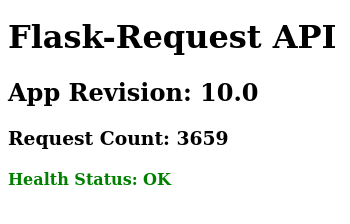

# flask-request

Flask API to show the number of requests and API health status.

## Overview

This is a Flask application that serves as a Request Counter API. It includes a simple web page displaying information about the application, including the request count and health status.

## Features

- Show the request count.
- Visualize the health status of the API.

## Dependencies

- Container Engine (Docker, ContainerD, Podman etc)
- git

## Getting Started

1. Clone the repository:

```shell
git clone https://github.com/alexolinux/flask-requester.git
```

2. Go to the project folder:

```shell
cd flask-request
```

3. Build the Docker Image:

```shell
docker build -t alexmbarbosa/flask-request:10.0 .
```

List my docker images:

```shell
docker image ls
REPOSITORY                       TAG            IMAGE ID       CREATED        SIZE
alexmbarbosa/flask-request       10.0           6a96582e9ffa   1 hours ago    91.8MB
```

- In this case, I am using the same docker that I have pushed to my docker hub repository already with this **[flask-request image](https://hub.docker.com/repository/docker/alexmbarbosa/flask-request/general)**. Feel free to use any name for your tag/image.

## Use cases (scenarios)

How about simulating a few load tests?

It is possible to use a useful Python tool called [Locust](https://locust.io/). For this, let's use our `flask-request` and the official `locust` docker image (Access ***[Locust on Docker](https://docs.locust.io/en/stable/running-in-docker.html)*** for more details).

1. Spin Up `flask-request` container:

```shell
docker run --rm --name flask-request -p 5000:5000 alexmbarbosa/flask-request:10.0
```


Open your `flask-request` page accessing http://localhost:5000 (or you local IP address (*containers are binding to `0.0.0.0:PORT`*))



2. Now, Spin Up `locust` container:

```shell
docker run --rm --name locust -p 8089:8089 -v $(pwd):/locust locustio/locust -f /locust/locustfile.py --host http://localhost:5000
```


Open your `locust` page accessing http://localhost:8089 (or you local IP address (*containers are binding to `0.0.0.0:PORT`*))


Locust Docs: https://docs.locust.io/en/stable/quickstart.html

### Extra-Option

Additionally, I am providing a `docker-compose.yml` simplifying the deployment of docker containers.

Just run:

```shell
docker-compose up
```


Now, you can make your custom workload tests.

Have fun!

---
### References

- https://hub.docker.com/repository/docker/alexmbarbosa/flask-request
- https://docs.docker.com/engine/reference/builder/
- https://docs.docker.com/samples/flask/
- https://locust.io/
- https://docs.locust.io/en/stable/running-in-docker.html

### Author
https://www.linkedin.com/in/mendesalex/
